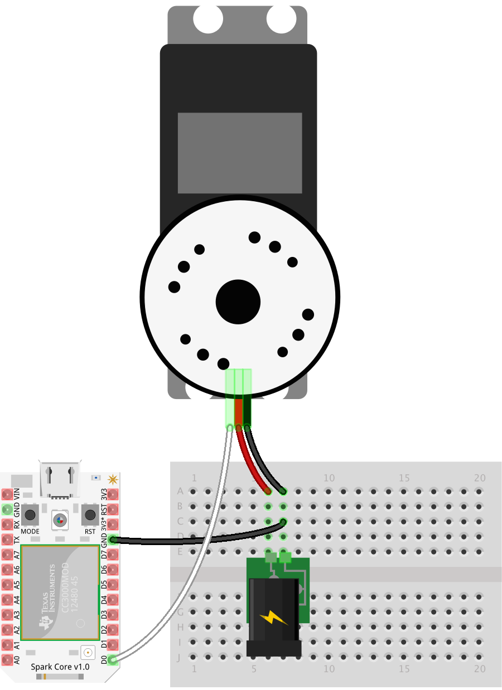

# Assembly

### Inventory


1. Battery box with 4 AA batteries. A single AA battery provides a 1.5V source, delivered at 700mA; when connected in series, 4 AA batteries provide 6V, delivered at 700mA. All three of the boards can operate with 6V; the Electric Imp and Spark Core will regulate to 3.3V and the Arduino Uno will regulate to 5V. The servos included in the kit operate at 6V.
2. Front panel
3. Photoresistor, or light sensor. This can be sourced from the ARDX Kit and will be used in a later customization of the bot.
4. LEDs: one green and one red. These are sourced from the ARDX Kit and will be used in a later customization of the bot.
5. Screws; the kit provides 6 and the build will use 2 on each side to secure the servo to the body. The remaining 2 will be used in the Arduino Uno build to fasten the board to the solderless breadboard for that build.
6. Left panel
7. Bottom panel
8. Ball caster; used in this build as the “back wheel” to support the rear of the bot.
9. Right panel
10. Left wheel
11. Left servo
12. Top panel
13. Right servo
14. Right wheel

### Preparation
Before proceeding to the assembly step, there are three major preparatory tasks that must be completed. Consider the project blocked until these tasks are complete.

1. Start a project directory: `mkdir <directory name>`

2. Install Node.js modules from npm.

```js
npm init (complete the initialization)
npm install johnny-five
npm install spark-io, npm install -g particle-cli

```

3. Setup and connection of controller board.
Particle Core (requires Internet connected Wi-Fi)

  - `particle setup`: this process will set up an account and claim the Particle Core. (More commands and information available here: particle-cli)

  - `particle flash REPLACE_WITH_DEVICE_ID voodoo`: this will flash the VoodooSpark firmware to the Spark Core with the provided device id. The built-in LED will flash magenta during the upload.

  - Once flashing is complete (as indicated by the built-in LED pulsing cyan), this terminal can closed.

4. Calibrate the Continuous Servos.

Missing or skipping this step is a direct path to failure.

When a continuous servo’s idle pulse is not calibrated to the available PWM range of the controller board, its behavior will be erratic and uncontrollable. Calibration is simple: send the known idle pulse to the servo and adjust the built-in potentiometer until the servo horn comes to a complete stop. If the servo is not moving when the idle pulse is written to the servo, then it’s safe to assume that the servo is already calibrated. To confirm, adjust the built-in potentiometer in clock-wise and counter clock-wise directions; the horn should respond by turning in the corresponding direction.

To calibrate the servos that came with the SumoBot kit, create a new file called calibrate.js containing the program for the controller board you’re setting up below. The purpose of the program is to connect to the board, initialize a continuous servo instance with the Servo.Continuous class and immediately call the instance’s stop method (which will send the idle pulse to the servo)



```
// calibrate.js
var five = require("johnny-five");
var Spark = require("spark-io");
var board = new five.Board({
  io: new Spark({
    token: "token",
    deviceId: "device id"
  })
});
board.on("ready", function() {
  new five.Servo.Continuous("D0").stop();
});
```
Run the program with the following:

`node calibrate.js`

While running, adjust the servo’s potentiometer until it comes to a complete stop. This video shows the operation in action:

<video controls="" class="blog-full-width-block" style="display: inline-block;width: 100%;margin: 0 0 1em 0;">
  <source src="https://dl.dropboxusercontent.com/u/3531958/sumobot/continuous-calibration.mp4">
  <source src="https://dl.dropboxusercontent.com/u/3531958/sumobot/continuous-calibration.webm">  
  <source src="https://dl.dropboxusercontent.com/u/3531958/sumobot/continuous-calibration.ogv">
  <iframe width="420" height="315" src="//www.youtube.com/embed/EeJwDsEuSdI" frameborder="0" allowfullscreen=""></iframe>
</video>

### Assembly
The SumoBot Kit includes an insert that provides a numbered and illustrated assembly guide; while the guide is adequate, this build is different enough to warrant its own set of instructions.

For each side panel, line up a servo so that the horn is closest to the front of that panel. The end of the servo with the wiring harness must be opposite of the cut out notch in the panel that would logically be used to thread the wiring through (which is facing to the back of the bot), but this build ignores that logic ;)

- These instructions are adapted from [Assembling and Preparing the RobotsConf Sumobot with Johnny-Five](https://bocoup.com/weblog/assembling-preparing-robotsconf-sumobot-with-johnny-five/) by [Rick Waldron, creator of Johnny Five](https://twitter.com/rwaldron)
