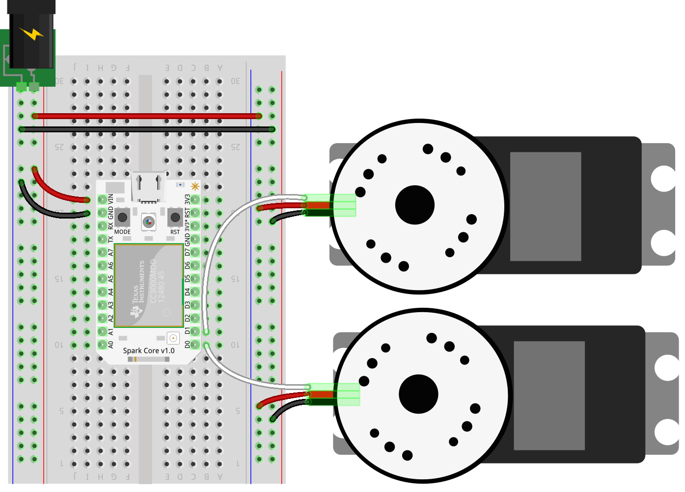
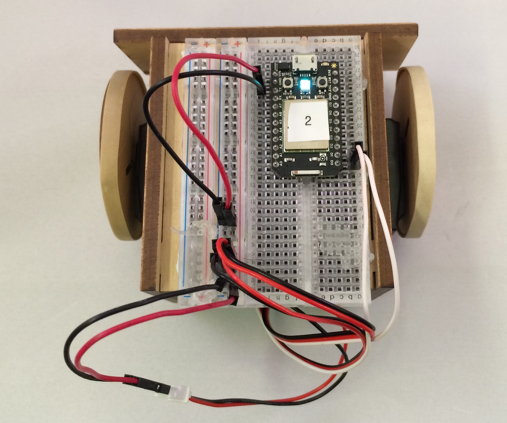

# Connecting the brain (Particle Core)

### Particle Core


### Sumobot Circuit


#### Fully assembled circuit attached to the Sumobot body


### Controlling The SumoBot

The controller program has been adapted from the original program provided in the [SumboBot Jr. repo](https://github.com/makenai/sumobot-jr) and is available via npm. The controls library, `keypress`, must also be installed.

```
npm install keypress sumobot

```

The keypress module will turn your laptop into a remote control device for the SumoBot, using the following keys -> command mappings:

| Key | Command |
| -- | -- |
| Arrow Up | Forward |
| Arrow Down | Reverse |
| Arrow Left | Turn Left |
| Arrow Right | Turn Right |
| Space | Stop |
| Q | Quit |

```js
// keyControl.js
var keypress = require("keypress");
var Spark = require("spark-io");
var five = require("johnny-five");
var Sumobot = require("sumobot")(five);

keypress(process.stdin);

var board = new five.Board({
  io: new Spark({
    token: process.env.SPARK_TOKEN,
    deviceId: process.env.SPARK_DEVICE_2
  })
});

board.on("ready", function() {

  console.log("Welcome to Sumobot Jr!");

  // Initialize a new Sumobot.
  // - Left Servo is attached to pin D0
  // - Right Servo is attached to pin D1
  // - Speed set to 0.50 (half of max speed)
  //
  var bot = new Sumobot({
    left: "D0",
    right: "D1",
    speed: 0.50
  });

  // Maps key names to bot methods
  var actions = {
    up: "fwd",
    down: "rev",
    left: "left",
    right: "right",
    space: "stop"
  };

  // Ensure the bot is stopped
  bot.stop();

  // A bit of keypress ceremony ;)
  process.stdin.resume();
  process.stdin.setEncoding("utf8");
  process.stdin.setRawMode(true);

  process.stdin.on("keypress", function(ch, key) {
    var action;

    if (!key) {
      return;
    }

    action = actions[key.name] || key.name;

    if (action == "q") {
      console.log("Quitting");
      bot.stop();
      setTimeout(process.exit, 500);
    }

    if (bot[action]) {
      bot[action]();
    }
  });
});

```
<video controls="" class="blog-full-width-block" style="display: inline-block;width: 100%;margin: 0 0 1em 0;">
  <source src="https://dl.dropboxusercontent.com/u/3531958/sumobot/sumo-spark.mp4">
  <source src="https://dl.dropboxusercontent.com/u/3531958/sumobot/sumo-spark.webm">  
  <source src="https://dl.dropboxusercontent.com/u/3531958/sumobot/sumo-spark.ogv">
  <iframe width="420" height="315" src="//www.youtube.com/embed/JZZUq4Zpcg8" frameborder="0" allowfullscreen=""></iframe>
</video>

These instructions are adapted from [Controlling the RobotsConf Sumobot with Spark Core & Johnny-Five](https://bocoup.com/weblog/controlling-the-robotsconf-sumobot-with-spark-core-johnny-five/) by [Rick Waldron, creator of Johnny Five](https://twitter.com/rwaldron)
