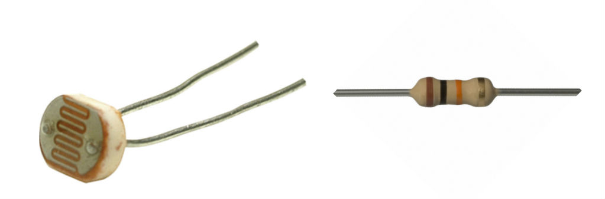

# Lightbot project

This customization will add a Light Dependent Resistor (Photocell) to the front of the bot to allow controlling the bot with a light source. When light is directed at the front of the SumoBot, it will move forward; when no light is present, it will stop. This is a simple demonstration of processing analog sensor input into actuator output.

The following items can be found in the AdaFruit.com and Radioshack:

- [Photocell](http://www.adafruit.com/products/161)
- [10kΩ resistor](http://comingsoon.radioshack.com/10k-ohm-1-4-watt-carbon-film-resistor-5-pack/2711335.html#.VbMBquhViko)



The following diagram describe the circuit layout for the controller board:


Here's the code that will run the Lightbot:

```js

var Spark = require("spark-io");
var five = require("johnny-five");
var Sumobot = require("sumobot")(five);

var board = new five.Board({
  io: new Spark({
    token: process.env.SPARK_TOKEN,
    deviceId: process.env.SPARK_DEVICE
  })
});

board.on("ready", function() {

  console.log("Welcome to Sumobot Jr: Light Bot!");

  var bot = new Sumobot({
    left: "D0",
    right: "D1",
    speed: 0.50
  });

  var light = new five.Sensor("A0");

  // More light => higher resistance => lower ADC value
  // If the reading is < 512, it's in direct light
  light.booleanAt(512).on("change", function() {
    bot[this.boolean ? "stop" : "fwd"]();
  });

  // Ensure the bot is stopped
  bot.stop();
});

```
Don't forget, for the above code to work, you'll need to install the node modules:

`npm install keypress spark-io johnny-five sumobot`

Here's a video of it in action:
<video controls="" class="blog-full-width-block" style="display: inline-block;width: 100%;margin: 0 0 1em 0;">
<source src="https://dl.dropboxusercontent.com/u/3531958/sumobot/sumo-light-bot.mp4">
<source src="https://dl.dropboxusercontent.com/u/3531958/sumobot/sumo-light-bot.webm">  
<source src="https://dl.dropboxusercontent.com/u/3531958/sumobot/sumo-light-bot.ogv">
<iframe width="560" height="315" src="//www.youtube.com/embed/JqDq705zxOg" frameborder="0" allowfullscreen=""></iframe>
</video>

These instructions are adapted from [Customizing the RobotsConf Sumobot with Johnny-Five](https://bocoup.com/weblog/customizing-the-robotsconf-sumobot-with-johnny-five/) by [Rick Waldron, creator of Johnny Five](https://twitter.com/rwaldron)
