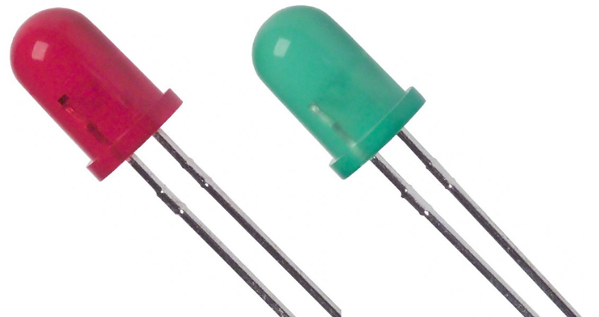
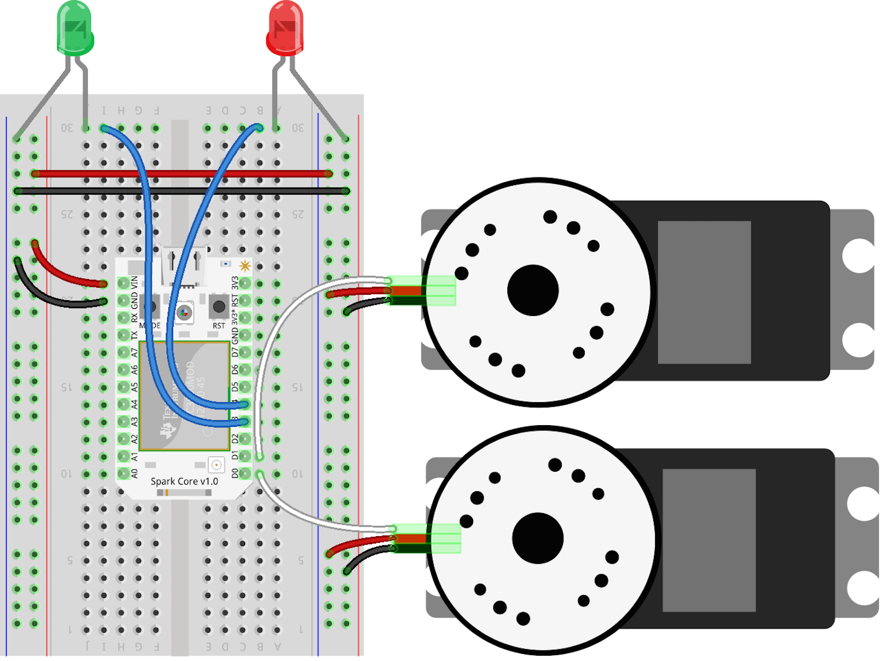

# Stop & Go project

This customization will add two LED’s, red and green, that light up according to the state of the SumoBot: red if stopped and green if moving. This may not seem like a very interesting customization since you can observe this state by just looking at the bot, but it serves to expose you to programming other forms of output with the existing control mechanism.

The following items can be found at AdaFruit.com:

- [Red LED](http://www.adafruit.com/products/297)
- [Green LED](http://www.adafruit.com/products/300)



The following diagram describe the circuit layout for the controller board:



Here's the code that will run the Stop & Go:

```js

var keypress = require("keypress");
var Spark = require("spark-io");
var five = require("johnny-five");
var Sumobot = require("sumobot")(five);

keypress(process.stdin);

var board = new five.Board({
  io: new Spark({
    token: process.env.SPARK_TOKEN,
    deviceId: process.env.SPARK_DEVICE
  })
});

board.on("ready", function() {

  console.log("Welcome to Sumobot Jr: Stop & Go!");

  var bot = new Sumobot({
    left: "D0",
    right: "D1",
    speed: 0.50
  });

  var red = new five.Led("D4");
  var green = new five.Led("D3");
  var leds = new five.Leds([red, green]);

  // Maps key names to bot methods
  var actions = {
    up: "fwd",
    down: "rev",
    left: "left",
    right: "right",
    space: "stop"
  };

  // Ensure the bot is stopped
  bot.stop();
  leds.off();

  // A bit of keypress ceremony ;)
  process.stdin.resume();
  process.stdin.setEncoding("utf8");
  process.stdin.setRawMode(true);

  process.stdin.on("keypress", function(ch, key) {
    var action;

    if (!key) {
      return;
    }

    leds.off();

    action = actions[key.name] || key.name;

    if (action == "q") {
      console.log("Quitting");
      bot.stop();
      setTimeout(process.exit, 500);
    }

    if (bot[action]) {
      bot[action]();

      if (action === "stop") {
        red.on();
      } else {
        green.on();
      }
    }
  });
});

```
Don't forget, for the above code to work, you'll need to install the node modules:

`npm install keypress spark-io johnny-five sumobot`

Here's a video of it in action:
<video controls="" class="blog-full-width-block" style="display: inline-block;width: 100%;margin: 0 0 1em 0;">
  <source src="https://dl.dropboxusercontent.com/u/3531958/sumobot/sumo-stop-go.mp4">
  <source src="https://dl.dropboxusercontent.com/u/3531958/sumobot/sumo-stop-go.webm">  
  <source src="https://dl.dropboxusercontent.com/u/3531958/sumobot/sumo-stop-go.ogv">
  <iframe width="420" height="315" src="//www.youtube.com/embed/wC86w0fX79s" frameborder="0" allowfullscreen=""></iframe>
</video>

These instructions are adapted from [Customizing the RobotsConf Sumobot with Johnny-Five](https://bocoup.com/weblog/customizing-the-robotsconf-sumobot-with-johnny-five/) by [Rick Waldron, creator of Johnny Five](https://twitter.com/rwaldron)
